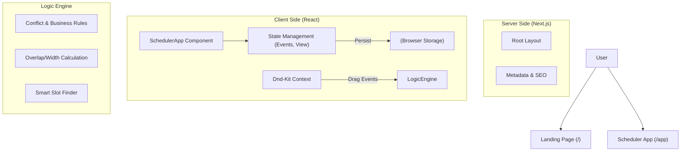

# UniFlow - The Intelligent University Scheduler

UniFlow is a modern, high-performance web application designed to revolutionize how students plan their academic lives. It replaces manual spreadsheet chaos with an intelligent, conflict-aware drag-and-drop interface.

> **Frontend Engineering Challenge Submission**
> *   **Role**: Frontend Engineering Intern
> *   **Stack**: Next.js 14+ (App Router), TypeScript, Tailwind CSS

## 🚀 Key Features

*   **Intelligent Scheduling Engine**:
    *   **Conflict Detection**: Prevents drag-and-drop on top of existing events (unless explicitly allowed by "Tetris" rules).
    *   **Smart "Tetris" Overlapping**: Overlapping courses dynamically resize (50%/50% width) to share column space, mimicking Google Calendar's behavior.
    *   **Logic Rules**: Enforces business logic like "Classes must end by 9 PM".
*   **Dynamic Data Persistence**:
    *   **Local Storage**: Your schedule is automatically saved to the browser.
    *   **CRUD Operations**: Add, Remove, and Reschedule classes freely.
*   **Premium UX/UI**:
    *   **Glassmorphism**: Modern, frosted-glass aesthetics using Tailwind and Framer Motion.
    *   **Micro-interactions**: Hover states, entrance animations, and "toast" notifications for every action.
    *   **Real-time Clock**: A dynamic "Red Line" indicator shows the current time on the schedule grid.

## 🏗️ Architecture

This project strictly follows **Next.js App Router** best practices, separating logic into **Server** and **Client** domains.

### Architecture Diagram



### Server vs. Client Split

1.  **Server Components**:
    *   `src/app/layout.tsx`: Handles the global HTML structure, fonts, and meta tags.
    *   `src/app/page.tsx`: The Landing Page is statically generated for maximum SEO and performance (High Interaction/First Contentful Paint).
2.  **Client Components**:
    *   `src/app/app/page.tsx`: The entire Scheduler Application. We chose to make this a Client Component (`'use client'`) because:
        *   It relies heavily on browser-only APIs (`localStorage`, `window`, `DragEvents`).
        *   It requires instant, interactive state updates for drag-and-drop which cannot be round-tripped to the server efficiently.
        *   It uses `framer-motion` for complex UI animations.

## 🧠 Logic & Algorithms

### 1. Smart "Tetris" Overlapping
Instead of blocking overlaps completely, we calculate visual collisions:
```typescript
const getEventStyle = (event, dayEvents) => {
   // Find all events that overlap in time with the current event
   const group = findOverlaps(event, dayEvents);
   // Divid width by number of overlapping events
   const width = 100 / group.length; 
   // Offset left based on index
   const left = width * group.indexOf(event);
   return { width, left };
}
```

### 2. Smart "Add Study Block" Algorithm
When you click "Add Study Block", the app acts as an intelligent agent:
1.  Iterates through **Mon-Fri**.
2.  Scans preferred hours (**9 AM - 4 PM**).
3.  Checks for **gaps** in the existing schedule.
4.  instantly books the **first available 1-hour slot**.

## 🛠️ Technology Stack

*   **Framework**: Next.js 16.1 (App Router)
*   **Language**: TypeScript (Strict Mode)
*   **Styling**: Tailwind CSS v4
*   **Animations**: Framer Motion
*   **Drag & Drop**: @dnd-kit/core, @dnd-kit/modifiers
*   **Icons**: Lucide React
*   **Utilities**: date-fns, clsx, tailwind-merge

## 📦 Installation & Setup

1.  **Clone the repository**:
    ```bash
    git clone https://github.com/yourusername/uniflow-scheduler.git
    cd uniflow-scheduler
    ```

2.  **Install dependencies**:
    ```bash
    npm install
    # or
    yarn install
    ```

3.  **Run the development server**:
    ```bash
    npm run dev
    ```

4.  **Open the app**:
    Visit `http://localhost:3000` in your browser.

## ✅ Requirements Checklist

- [x] **Landing Page**: Demonstrates Design Thinking & Visual Hierarchy.
- [x] **Scheduler App**: Demonstrates Logic & State Management.
- [x] **Drag & Drop**: Fully functional using `@dnd-kit`.
- [x] **Validation Rules**: Enforces business hours (9 PM limit).
- [x] **Visual Feedback**: Physics-based drag scaling and error toasts.
- [x] **Type Safety**: Strictly typed interfaces for `Course` and `SchedulerEvent`.
- [x] **Responsive Design**: Works on Desktop and has mobile-friendly navigation.

---

*Designed and Built by Diksha Deware*
